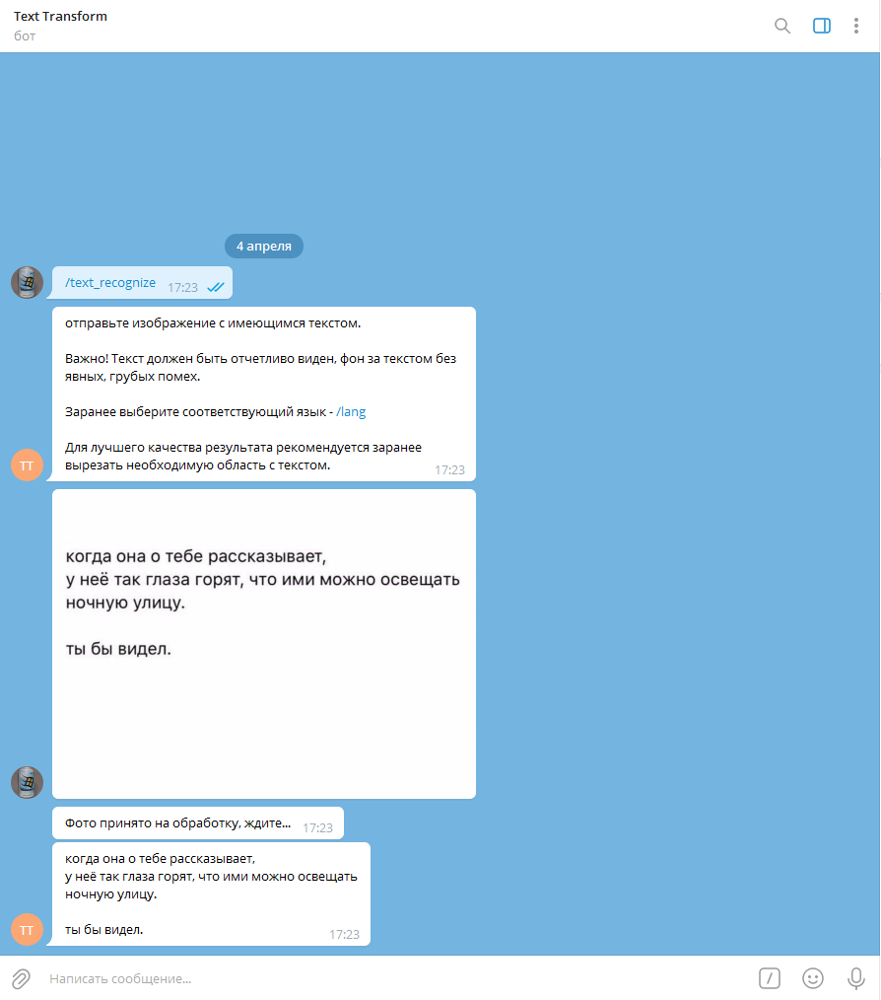
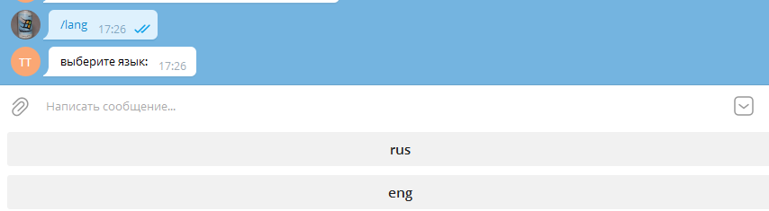
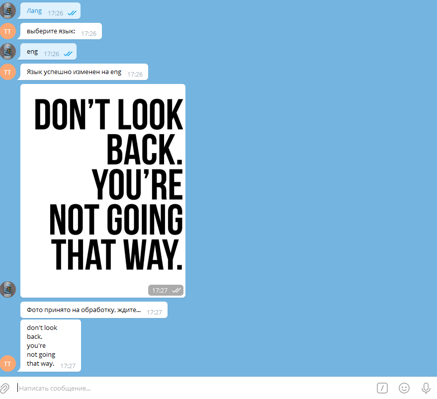

# Простой бот, работающий c Tesseract

Распознает текст на изображении, отправленном пользователем и отправляет его в ответ сообщением.

Не способен по умолчанию идентифицировать язык текста. Необходимо указать через команду: 
>  /lang 

data/config - забирает переменные окружения. В .env необходимо указать путь к директории Tesseract - OCR

